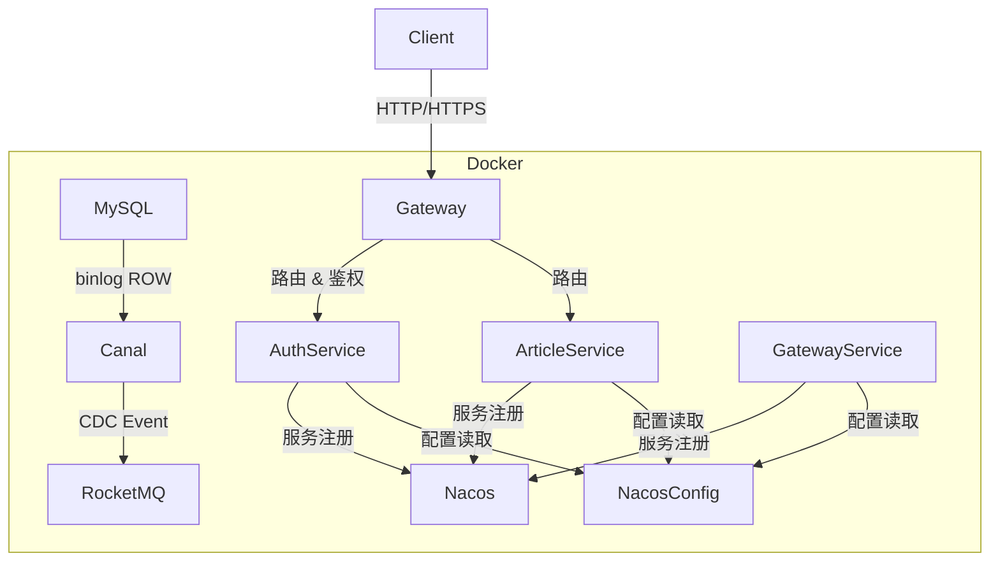

# eblog 微服务博客系统 — 技术难点与亮点总结

## 项目概述

基于 Spring Cloud Alibaba 微服务架构的企业级博客系统，采用前后端分离架构，实现了文章管理、用户认证、评论互动等核心功能。系统从单体架构演进为微服务架构，解决了单体应用在扩展性、高可用、团队协作等方面的瓶颈。

> **关键词：** 微服务、Spring Cloud Alibaba、Nacos、Sentinel、RocketMQ、Canal、多级缓存、双 Token 认证

---

## 一、微服务架构设计与服务治理

### 技术栈
- **基础框架：** Spring Boot 3.4.4 + Spring Cloud 2024.0.0 + Spring Cloud Alibaba 2023.0.3.2
- **Java 版本：** Java 17（利用 Records、Sealed Classes、Text Blocks 等新特性）
- **服务注册与配置中心：** Nacos 2.4.3（AP 模式保障可用性）
- **服务网关：** Spring Cloud Gateway（WebFlux 响应式编程模型）

### 亮点与难点
**1. 服务拆分粒度控制**
将单体应用拆分为 gateway-service（网关）、auth-service（认证）、article-service（文章）等九个微服务：
- **gateway-service** (8080)：API 网关，统一认证与限流
- **auth-service** (8081)：双 Token JWT 认证
- **article-service** (8082)：文章与草稿 CRUD
- **query-service** (8083)：读写分离，文章查询 + 多级缓存
- **comment-service** (8084)：独立评论服务，支持嵌套回复与审核
- **search-service** (8085)：全文搜索 + 搜索建议 + 热搜排行
- **intelligence-service** (8086)：AI 辅助（摘要、关键词、相关推荐）
- **notification-service** (8087)：系统通知 + 评论回复通知
- **file-service** (8088)：多存储后端文件管理
拆分时遵循「业务职责单一」原则，每个服务拥有独立的数据库表空间，避免了跨服务直接查询。

**2. Nacos 配置中心动态刷新**
所有业务配置（数据库连接、Redis、JWT 密钥、阿里云 OSS 凭证）存储在 Nacos 配置中心，服务启动时通过 `spring.config.import=optional:nacos:{service-name}?refreshEnabled=true` 拉取。配置变更通过 Actuator `/refresh` 端点实现动态刷新，无需重启服务。

**3. Gateway 响应式架构挑战**
Gateway 基于 WebFlux 响应式模型，与常规 Spring MVC 不兼容。解决思路：
- `common-core` 模块在使用时需排除 `spring-boot-starter-web`
- Redis 操作必须使用 `ReactiveRedisTemplate`（`spring-boot-starter-data-redis-reactive`）
- CORS 配置使用 `CorsWebFilter`（响应式变体）
- 自定义 GatewayFilter 需实现 `AbstractGatewayFilterFactory`

---

## 二、双 Token 认证体系 + RSA 非对称加密

### 技术栈
- **JWT 库：** JJWT 0.12.6
- **加密算法：** RS256（RSA-SHA256）非对称加密
- **Token 存储：** Redis + 黑名单机制

### 亮点与难点
**1. 非对称加密的架构收益**
采用 RSA 非对称加密方案，**Auth Service 持有私钥用于签名，Gateway 仅持有公钥用于本地验签**。这意味着网关对每个请求的 Token 验证是纯本地操作，无需远程 RPC 调用 auth-service，避免了认证服务的流量压力瓶颈，将认证延迟降低到纳秒级（本地 JVM 运算）。

**2. 双 Token 滑动窗口设计**
| Token 类型 | 有效期 | 存储位置 | 刷新策略 |
|-----------|--------|---------|---------|
| Access Token | 15 分钟 | 客户端（内存/Header） | 过期后由 Refresh Token 自动续期 |
| Refresh Token | 7 天 | Redis + 客户端 | 每次使用刷新后更新 TTL，形成滑动窗口 |

客户端（前端）实现了自动无感刷新：API 拦截器在收到 401 后，通过 Promise-lock 机制**折叠并发刷新请求**，避免多个请求同时触发刷新导致竞态条件。

**3. Token 泄露检测**
当 Refresh Token 被替换后，旧 Refresh Token 若被再次使用（表明可能泄露），系统会判定为 Token 泄露事件，**吊销该用户所有已颁发的 Token**（清空 Redis 中该用户的所有 refresh token + 将当前 access token 加入黑名单）。这是一种主动安全策略，比单纯依赖过期时间更可靠。

**4. 精细化错误码**
定义四级 Token 异常码，便于前端精准处理：
- `4011 TOKEN_EXPIRED` — 触发自动刷新流程
- `4012 TOKEN_INVALID` — 跳转登录页
- `4013 TOKEN_BLACKLISTED` — 提示账户异常
- `4014 REFRESH_TOKEN_EXPIRED` — 跳转登录页

---

## 三、多级缓存架构（Caffeine + Redis）

### 技术栈
- **L1 本地缓存：** Caffeine（基于 JVM 堆内缓存）
- **L2 分布式缓存：** Redis 7（Alpine）
- **实现机制：** 自研 `MultiCacheManager` 统一抽象

### 亮点与难点
**1. 两级缓存穿透防护**
```
读流程：L1(Caffeine) → L2(Redis) → DB
写流程：更新 DB → 删除 L1 → 删除 L2
```
- L1 缓存未命中时查询 L2，L2 命中后将数据回写到 L1，后续同节点请求直接命中 L1
- L1 和 L2 的 TTL 独立配置（L1 默认 30 分钟，L2 默认 60 分钟），L1 更短以保持一致性

**2. 缓存配置参数**
| 参数 | 默认值 | 说明 |
|------|--------|------|
| 最大容量 | 5000 条 | 防止本地堆内存溢出 |
| L1 TTL | 30 分钟 | 写入后过期 |
| L2 TTL | 60 分钟 | 写入后过期 |
| 统计模式 | 开启 | Caffeine 内置的命中率统计 |

**3. 优雅降级**
Redis 连接异常时捕获异常并记录日志，返回 null 而非抛出异常使请求中断。系统降级为仅使用本地缓存 + 直接查询数据库，保证核心业务流程不受缓存中间件故障影响。

**4. 待扩展的缓存一致性方案**
当前采用「更新 DB 后删除缓存」的被动失效模式。项目预留了通过 RocketMQ 广播缓存失效事件的架构扩展点（Canal CDC 已部署），可实现跨服务实例的缓存一致性。

---

## 四、CDC 数据同步管道（Canal + RocketMQ）

### 技术栈
- **CDC 工具：** Canal 1.1.7（阿里巴巴开源 MySQL binlog 解析器）
- **消息队列：** RocketMQ 5.3.1
- **监听模式：** MySQL Row-Based Binlog

### 亮点与难点
**1. 架构设计**
```
MySQL (binlog ROW 模式)
  → Canal (伪装为 MySQL Slave，解析 binlog)
    → RocketMQ Topic: cdc-topic
      → 下游消费者（缓存刷新、搜索索引更新、数据统计等）
```

**2. 业务价值**
- **解耦数据变更与业务逻辑**：业务代码无需关注缓存刷新、搜索索引更新等副作用
- **保证最终一致性**：基于 MQ 的异步重试机制，即使下游消费失败也不会影响主流程
- **可扩展性**：新增消费端只需订阅 `cdc-topic`，无需修改已有代码

**3. 技术难点**
- Canal 要求 MySQL 开启 binlog 并设置为 ROW 格式（已配置 `binlog-format=ROW`）
- Canal Server 连接到 MySQL 时模拟为 Slave 节点，需要 MySQL 有复制权限的账号
- RocketMQ Broker 需配置正确的网络拓扑（`brokerIP1` 避免容器内外地址不一致）

---

## 五、Sentinel 流量控制与熔断降级

### 技术栈
- **限流框架：** Sentinel（集成 spring-cloud-alibaba-sentinel-gateway）
- **部署模式：** 网关层限流 + 服务层 Feign 熔断

### 亮点与难点
**1. 精细化流量控制规则**
通过 `SentinelConfig.java` 程序化定义四组限流规则：

| API 分组 | QPS 阈值 | Burst | 控制行为 | 设计考量 |
|---------|---------|-------|---------|---------|
| 读接口（文章列表、搜索） | 1000 | 200 | 快速失败 | 读多写少，容忍少量突刺 |
| 写接口（发布文章、草稿） | 50 | 10 | 排队等待 | 保护数据库写入性能 |
| 认证接口（登录、刷新） | 20 | - | 快速失败 | 防暴力破解 |
| 热点参数（文章详情） | 200 | 50 | 参数维度限流 | 防止热点文章被打满 |

**2. 网关 + Feign 双重降级**
- **网关层：** `FallbackHandler` 实现 `ErrorWebExceptionHandler`，统一返回 JSON 格式错误（HTTP 429/503/504）
- **服务层：** Feign 客户端 `AuthClient` 配置 `AuthClientFallbackFactory`，auth-service 不可用时返回「认证服务不可用」降级响应

**3. 热点参数限流**
对 `GET /api/articles/{id}` 按文章 ID 进行参数级别限流，防止某篇爆款文章导致整个接口被打满。这是 Sentinel 区别于普通计数器限流的核心能力。

---

## 六、分布式链路追踪

### 实现方式
- 自定义 `TraceIdUtils` 生成格式为 `eblog-{uuid}` 的 TraceId
- Gateway 通过 `GatewayFilter` 在每个请求进入时生成 TraceId，通过 `X-Trace-Id` 和 `X-Request-Id` 请求头透传到下游服务
- 下游服务在日志中输出 TraceId，便于基于日志的分布式问题排查

### 设计决策
未引入 SkyWalking / Zipkin 等完整 APM 系统，而是采用轻量级 TraceId 透传方案，减少架构复杂度。TraceId 复用 JWT 的 `jti`（JWT ID），实现认证链路与追踪链路的统一。

---

## 七、文章编辑器与前端工程化

### 技术栈
- **框架：** React 19 + Vite 8
- **富文本编辑器：** TipTap（基于 ProseMirror）
- **语法高亮：** lowlight（highlight.js 的轻量级封装）

### 亮点与难点
**1. TipTap 编辑器深度定制**
- 自定义 `SlashCommands` 插件：输入 `/` 触发命令面板，支持快速插入标题、代码块、表格、引用等
- 自定义 `BubbleMenu` 插件：选中文本后弹出浮动格式工具栏
- 自定义 `CodeBlockView` 代码块节点视图：支持 24+ 语言语法高亮，行号显示
- Markdown 粘贴检测：剪贴板内容识别为 Markdown 时自动转换为 TipTap 节点

**2. 草稿自动保存**
- 2 秒防抖自动保存草稿
- 保存状态实时指示（「已保存」/「保存中...」/「未保存的更改」）
- 支持草稿管理（新增 / 恢复 / 删除）

**3. 前端 API 拦截器**
```
请求 → 检查 Access Token → 携带 Authorization Header → 发送
响应 401 → 尝试 Refresh Token → 更新本地 Token → 重放请求
响应再次 401 → 清除 Token → 跳转登录页
```
使用 Promise 锁机制解决并发 401 场景下重复刷新的竞态问题，确保同一时刻只有一个刷新请求在执行，其余请求排队等待新 Token。

---

## 八、基础设施容器化部署

### 架构拓扑


### 容器组件
| 组件 | 版本 | 核心配置 |
|------|------|---------|
| MySQL | 8.0 | binlog_format=ROW, 数据库 my_blog |
| Redis | 7 Alpine | allkeys-lru 淘汰策略, maxmemory 256mb |
| Nacos | 2.4.3 | 独立模式, 认证开启, gRPC 端口 9848 |
| RocketMQ | 5.3.1 | Namesrv + Broker + Dashboard(18080) |
| Canal | 1.1.7 | 监听 my_blog 全部表, 目标 RocketMQ cdc-topic |

---

## 九、写在最后

以上所有技术方案均已在项目中落地实现（代码位于项目 `back/` 和 `front/` 目录），并非概念性设计。项目中还有一些值得注意的经验教训：

- **异常码体系设计**：通过 `ResultCode` 枚举统一定义业务异常码，前端根据 code 做差异化处理，比单纯依赖 HTTP Status Code 更精确
- **统一响应体 `Result<T>`**：所有接口返回 `{code, message, data, timestamp, traceId}` 的格式，便于前端统一处理
- **跨模块 Feign DTO 共享**：`common-dto` 模块集中管理跨服务调用的请求/响应 DTO，避免重复定义
- **密码明文问题**：当前登录实现中密码以明文比对，生产环境应引入 BCrypt 等哈希算法（已识别为待优化项）
